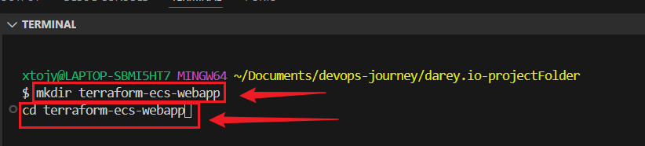
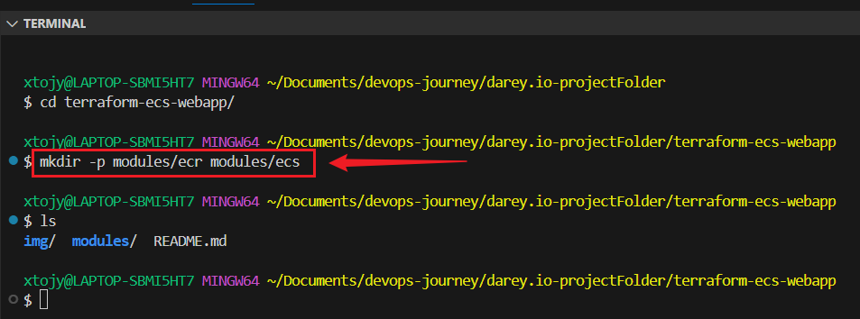
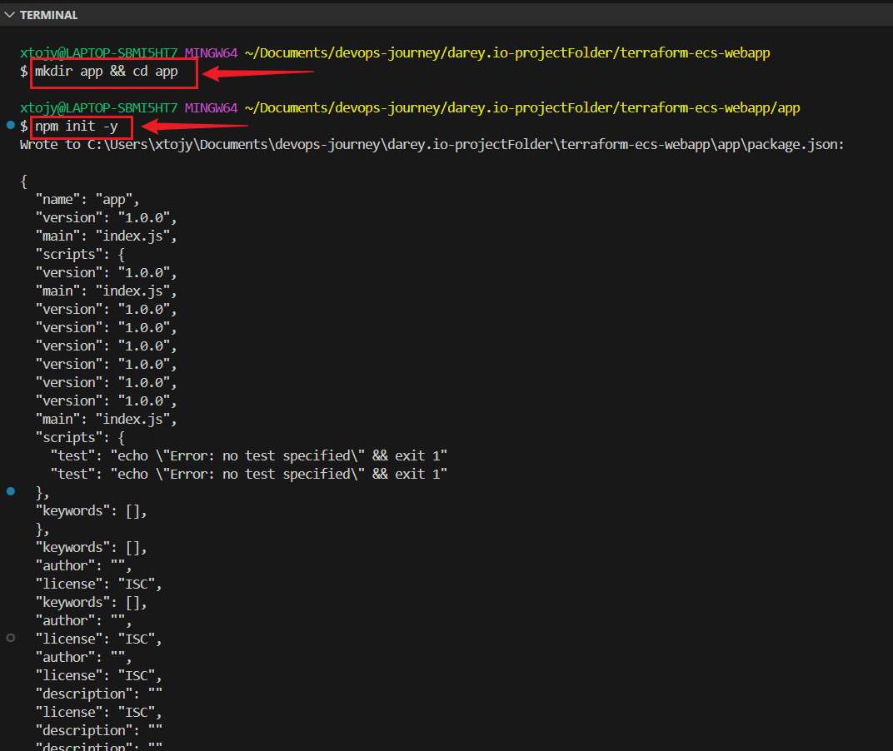
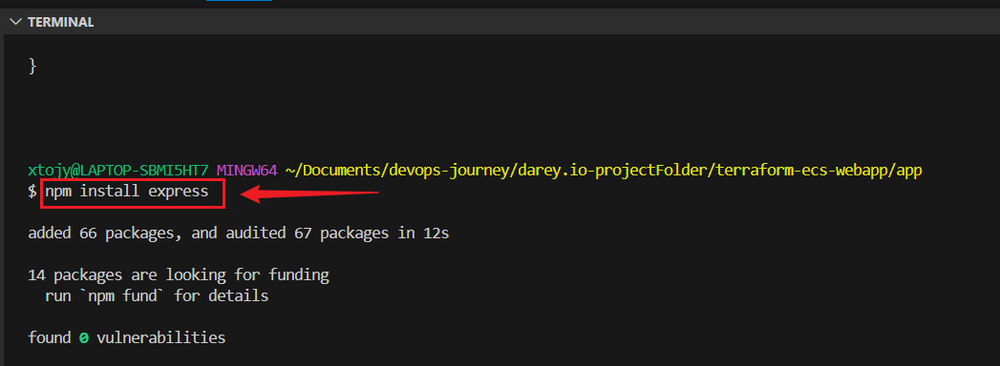
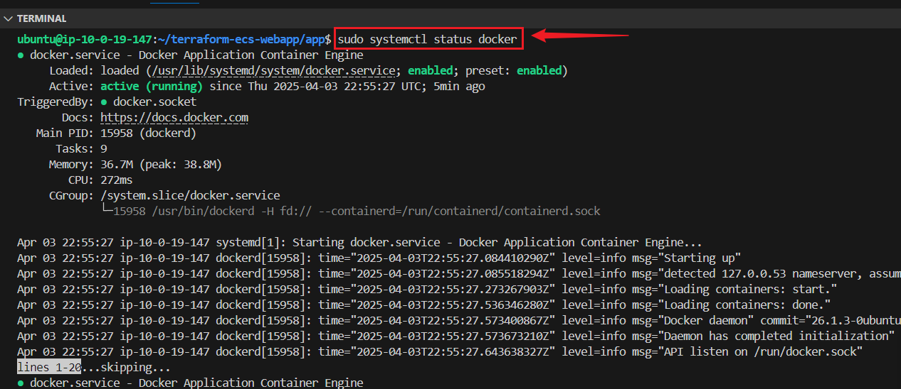
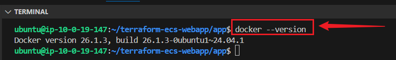
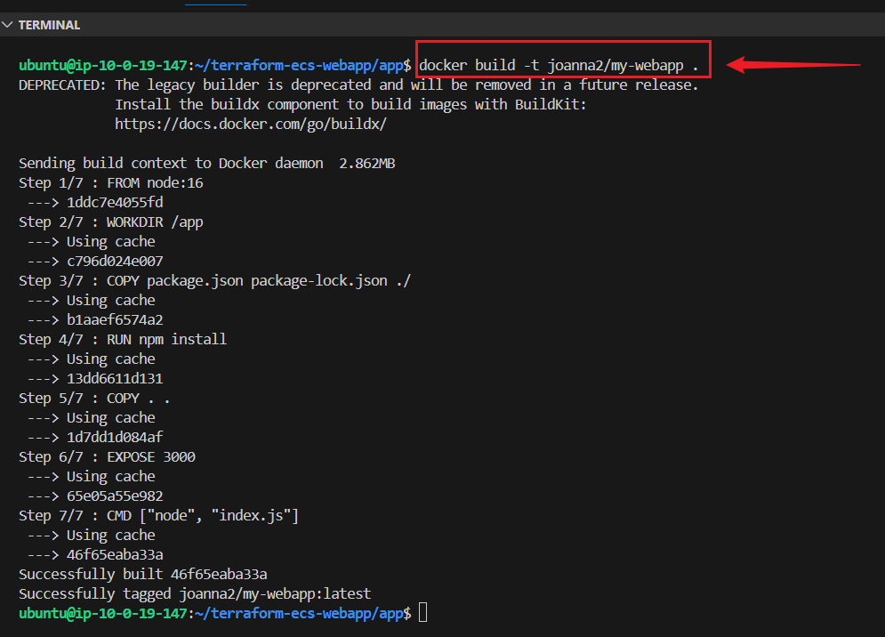
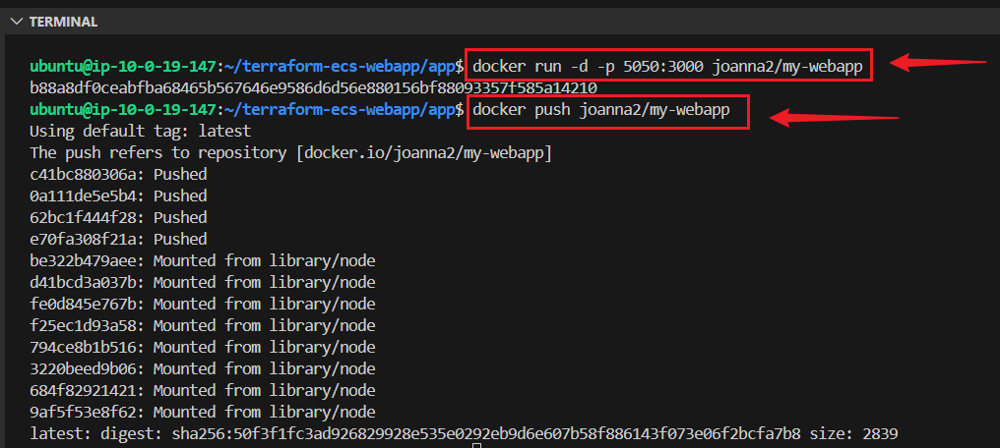

# Hosting a Dynamic Web App on AWS with Terraform, Docker, ECR, and ECS

## Project Overview

This project demonstrates how to deploy a Dockerized web application on AWS using Terraform, Amazon ECR, and ECS. The web app is built using Node.js & Express.js, containerized with Docker, and managed through Terraform for infrastructure provisioning.
---

## Project Structure

```
terraform-ecs-webapp/
│── app/
│   ├── index.js  # Node.js Web App
│   ├── package.json  # Node.js Dependencies
│   ├── Dockerfile  # Docker Configuration
│
│── modules/
│   ├── ecr/
│   │   ├── main.tf  # ECR Module
│   ├── ecs/
│   │   ├── main.tf  # ECS Module
│   │   ├── variables.tf  # ECS Variables
│
│── main.tf  # Terraform Main Configuration
│── README.md  # Documentation
```

---

## Prerequisites

+ Ensure the following tools are installed:

+ Docker → Install Here

+ Terraform → Install Here

+ AWS CLI → Install Here

+ Node.js → Install Here
---


## Step 1: Create Your Project Structure

Open your terminal and run:
```
mkdir terraform-ecs-webapp
cd terraform-ecs-webapp
mkdir -p modules/ecr modules/ecs
```
This creates a clean directory structure.


---

## Step 2: Create the Web App

Since this is a Dockerized Web App, I will use **Node.js**.

+ **Initialize a Node.js project:**
```
mkdir app && cd app
npm init -y
npm install express
```




+ **Create an index.js file inside app/:**
```
nano index.js
```
```
const express = require('express');
const app = express();

app.get('/', (req, res) => {
    res.send('Hello, World! Welcome to my AWS-hosted Web App 🚀');
});

const PORT = process.env.PORT || 3000;
app.listen(PORT, () => {
    console.log(`Server is running on port ${PORT}`);
});
```

 + **Create a Dockerfile inside app/:**
 ```
 *-nano Dockerfile
 ```
```
FROM node:16

WORKDIR /app

COPY package.json package-lock.json ./
RUN npm install

COPY . .

EXPOSE 3000

CMD ["node", "index.js"]
```

## Create .gitignore to Exclude Sensitive Files
```
touch .gitignore
```

## Open .gitignore and add the following:
```
# Ignore Terraform state files
*.tfstate
*.tfstate.backup
.terraform/
.terraform.lock.hcl

# Ignore AWS credentials
*.pem
*.key
```

## Create a New GitHub Repository without initializing it:
```
terraform-modules-vpc-s3
```

## Initialize Git:
```
git init
```

## Add Your .gitignore File
```
git add .gitignore
```

## Stage Other Files
```
git add .
```

## Make the Initial Commit
```
git commit -m "Initial commit with .gitignore"
```

## Rename the Branch to main
```
git branch -m master main
```

## Connect to a Remote Repository
```
git remote add origin https://github.com/yourusername/your-repository.git
```

## Push Your Code to the Remote Repository
```
git push -u origin main
```

 ## Set up Docker
 Create an EC2 Instance, clone your repository into it and install docker:

## Update the package manager and install Docker:
```
sudo apt update -y
sudo apt upgrade -y
sudo apt install -y docker.io
```

## Start, enable and check status of the Docker service:
```
sudo service docker start
sudo systemctl enable docker
sudo systemctl status docker
```


## Add the current user to the Docker group
```
sudo usermod -aG docker $USER
newgrp docker
```

## Verify the installation
```
docker --version
```


## Log in to Docker Hub from EC2
```
docker login
```
Enter your Docker Hub username and password when prompted.

If successful, you'll see:
```
Login Succeeded
```

+ **Build and List the Docker Image on EC2 :**
```
cd app
docker build -t joanna2/my-webapp .
docker images
```


## Test the Image Locally
Run it directly:
```
docker run -d -p 5050:3000 joanna2/my-webapp
curl http://localhost:5050
```
**Open http://localhost:5050 in your browser.**

## Push the Image to Docker Hub
```
docker push joanna2/my-webapp
```



## Step 3: Write Terraform Scripts

## Create the ECR Module (modules/ecr/main.tf)
```
nano modules/ecr/main.tf
```

This will create an Amazon ECR repository.
```
resource "aws_ecr_repository" "my_ecr_repo" {
  name                 = "my-webapp-repo"
  image_scanning_configuration {
    scan_on_push = true
  }
}

output "repository_url" {
  value = aws_ecr_repository.my_ecr_repo.repository_url
}
```

**Inside modules/ecr/variables.tf**
```
nano variable.tf
```
**Paste**
```
variable "repository_name" {
  description = "The name of the ECR repository"
  type        = string
}
```

## Create the ECS Module (modules/ecs/main.tf)
```
nano modules/ecs/main.tf
```

This will create an ECS cluster and deploy the web app.
```
resource "aws_ecs_cluster" "ecs_cluster" {
  name = "my-ecs-cluster"
}

resource "aws_ecs_task_definition" "ecs_task" {
  family                   = var.service_name
  network_mode             = "awsvpc"
  requires_compatibilities = ["FARGATE"]
  cpu                      = "256"
  memory                   = "512"

  container_definitions = jsonencode([
    {
      name      = "my-webapp-service",
      image     = var.ecr_repository_url,
      cpu       = 256,
      memory    = 512,
      essential = true,
      portMappings = [
        {
          containerPort = var.container_port,
          hostPort      = var.container_port
        }
      ]
    }
  ])
}

output "ecs_cluster_name" {
  value = aws_ecs_cluster.ecs_cluster.name
}
```


## Create a variables.tf file inside modules/ecs/ for ECR repository URL input:
```
variable "ecr_repository_url" {}
variable "cluster_name" {}
variable "service_name" {}
variable "container_port" {}
```

## Step 4: Create the Main Terraform Configuration (main.tf)
```
nano main.tf
```

This ties everything together.
```
provider "aws" {
  region = "us-east-1"  
}

module "ecr" {
  source          = "./modules/ecr"
  repository_name = "my-webapp-repo"  
}

module "ecs" {
  source             = "./modules/ecs"
  ecr_repository_url = module.ecr.repository_url  
  cluster_name       = "my-ecs-cluster"  
  service_name       = "my-webapp-service" 
  container_port     = 3000 
}
```

## Step 5: Deploy the Infrastructure
Now, let’s run Terraform to create AWS resources.

Initialize Terraform:
```
terraform init
``` 

**Validate and Plan Terraform Deployment**
Before applying the changes, check if the configuration is correct:
```
terraform validate
```

**Run the plan command to see what Terraform will create:**
```
terraform plan
```

Apply the Terraform Configuration
Run:
```
terraform apply
```