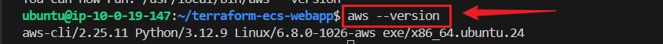
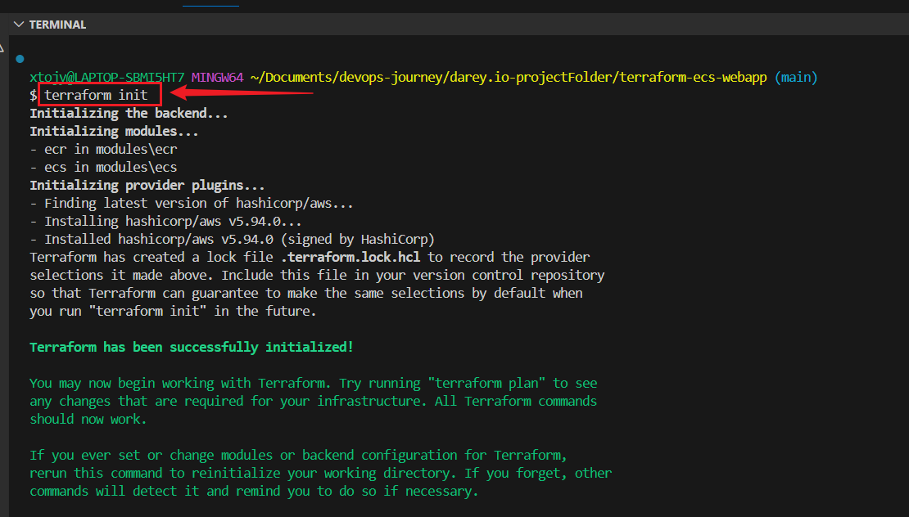
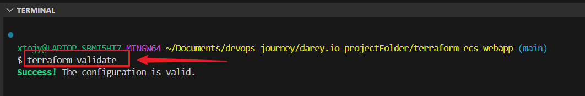
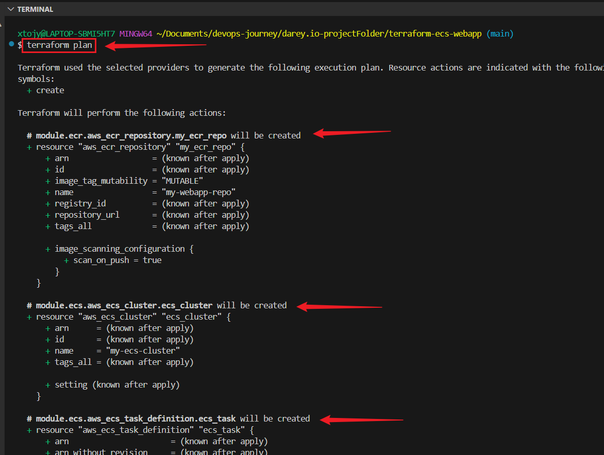
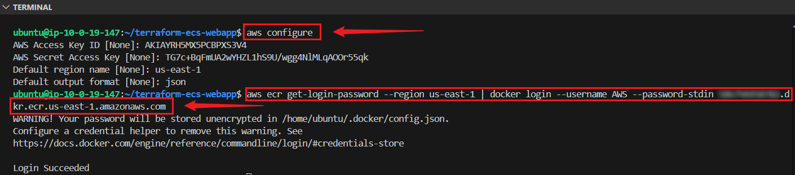
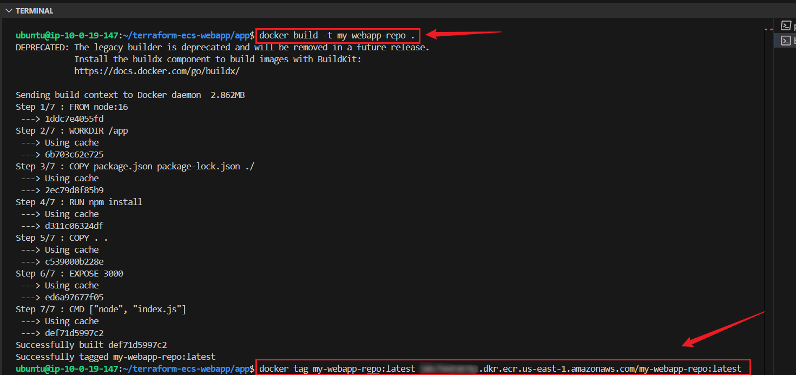
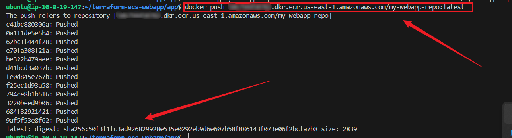
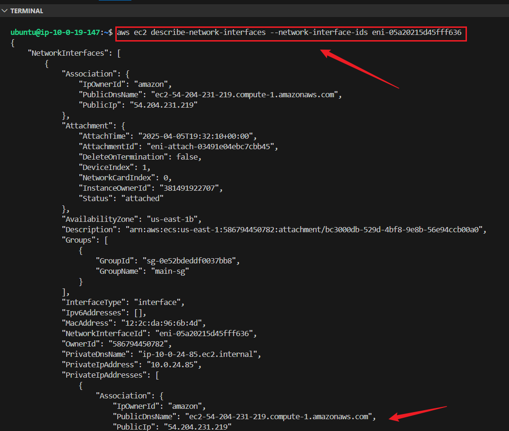
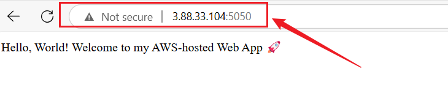
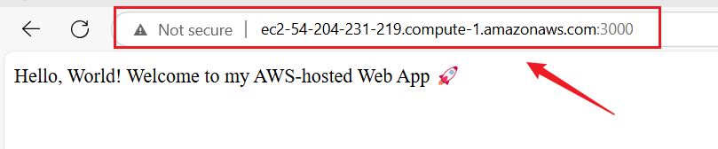

# Hosting a Dynamic Web App on AWS with Terraform, Docker, ECR, and ECS

## Project Overview

This project demonstrates how to deploy a Dockerized web application on AWS using Terraform, Amazon ECR, and ECS. The web app is built using Node.js & Express.js, containerized with Docker, and managed through Terraform for infrastructure provisioning.


## Project Structure

```
terraform-ecs-webapp/
│── app/
│   ├── index.js  # Node.js Web App
│   ├── package.json  # Node.js Dependencies
│   ├── Dockerfile  # Docker Configuration
│
│── modules/
│   ├── ecr/
│   │   ├── main.tf  # ECR Module
│   ├── ecs/
│   │   ├── main.tf  # ECS Module
│   │   ├── variables.tf  # ECS Variables
│
│── main.tf  # Terraform Main Configuration
│── README.md  # Documentation
```

---

## Prerequisites

+ Ensure the following tools are installed:

+ Docker → Install Here

+ Terraform → Install Here

+ AWS CLI → Install Here

+ Node.js → Install Here
---


## Step 1: Create Your Project Structure

Open your terminal and run:
```
mkdir terraform-ecs-webapp
cd terraform-ecs-webapp
mkdir -p modules/ecr modules/ecs
```
This creates a clean directory structure.


---

## Step 2: Create the Web App

Since this is a Dockerized Web App, I will use **Node.js**.

+ **Initialize a Node.js project:**
```
mkdir app && cd app
npm init -y
npm install express
```


+ **Create an index.js file inside app/:**
```
nano index.js
```
```
const express = require('express');
const app = express();

app.get('/', (req, res) => {
    res.send('Hello, World! Welcome to my AWS-hosted Web App 🚀');
});

const PORT = process.env.PORT || 3000;
app.listen(PORT, () => {
    console.log(`Server is running on port ${PORT}`);
});
```

 + **Create a Dockerfile inside app/:**
 ```
 *-nano Dockerfile
 ```
```
FROM node:16

WORKDIR /app

COPY package.json package-lock.json ./
RUN npm install

COPY . .

EXPOSE 3000

CMD ["node", "index.js"]
```

## Create .gitignore to Exclude Sensitive Files
```
touch .gitignore
```

## Open .gitignore and add the following:
```
# Ignore Terraform state files
*.tfstate
*.tfstate.backup
.terraform/
.terraform.lock.hcl

# Ignore AWS credentials
*.pem
*.key
```

## Create a New GitHub Repository without initializing it:
```
terraform-modules-vpc-s3
```

## Initialize Git:
```
git init
```

## Add Your .gitignore File
```
git add .gitignore
```

## Stage Other Files
```
git add .
```

## Make the Initial Commit
```
git commit -m "Initial commit with .gitignore"
```

## Rename the Branch to main
```
git branch -m master main
```

## Connect to a Remote Repository
```
git remote add origin https://github.com/yourusername/your-repository.git
```

## Push Your Code to the Remote Repository
```
git push -u origin main
```

 ## Set up Docker
 Create an EC2 Instance, clone your repository into it and install docker:

```
git clone https://github.com/Joy-it-code/terraform-ecs-webapp.git
```

## Update the package manager and install Docker:
```
sudo apt update -y
sudo apt upgrade -y
sudo apt install -y docker.io
```

## Start, enable and check status of the Docker service:
```
sudo service docker start
sudo systemctl enable docker
sudo systemctl status docker
```


## Add the current user to the Docker group
```
sudo usermod -aG docker $USER
newgrp docker
```

## Verify the installation
```
docker --version
```


## Log in to Docker Hub from EC2
```
docker login
```
Enter your Docker Hub username and password when prompted.

If successful, you'll see:
```
Login Succeeded
```

+ **Build and List the Docker Image on EC2 :**
```
cd app
docker build -t joanna2/my-webapp .
docker images
```


## Test the Image Locally
Run it directly:
```
docker run -d -p 5050:3000 joanna2/my-webapp
curl http://localhost:5050
```
**Open http://localhost:5050 in your browser.**

## Push the Image to Docker Hub
```
docker push joanna2/my-webapp
```


## Install AWS CLI
**Run**
```
curl "https://awscli.amazonaws.com/awscli-exe-linux-x86_64.zip" -o "awscliv2.zip"
unzip awscliv2.zip
sudo ./aws/install
aws --version
```



## Step 3: Write Terraform Scripts

## Create the ECR Module (modules/ecr/main.tf)
```
nano modules/ecr/main.tf
```

This will create an Amazon ECR repository.
```
resource "aws_ecr_repository" "my_ecr_repo" {
  name = var.repository_name  

  image_scanning_configuration {
    scan_on_push = true
  }
}

output "repository_url" {
  value = aws_ecr_repository.my_ecr_repo.repository_url
}
```

**Inside modules/ecr/variables.tf**
```
nano variable.tf
```
**Paste**
```
variable "repository_name" {
  description = "The name of the ECR repository"
  type        = string
}
```
---

## Create the ECS Module (modules/ecs/main.tf)
```
nano modules/ecs/main.tf
```

This will create an ECS cluster and deploy the web app.
```
resource "aws_ecs_cluster" "ecs_cluster" {
  name = "my-ecs-cluster"
}

resource "aws_ecs_task_definition" "ecs_task" {
  family                   = var.service_name
  network_mode             = "awsvpc"
  requires_compatibilities = ["FARGATE"]
  cpu                      = "256"
  memory                   = "512"
  execution_role_arn       = "arn:aws:iam::586794450782:role/ecsTaskExecutionRole"

  container_definitions = jsonencode([
    {
      name      = "my-webapp-service",
      image     = var.ecr_repository_url,
      cpu       = 256,
      memory    = 512,
      essential = true,
      portMappings = [
        {
          containerPort = 3000
        }
      ]
    }
  ])
}

resource "aws_ecs_service" "ecs_service" {
  name            = var.service_name
  cluster         = aws_ecs_cluster.ecs_cluster.id
  task_definition = aws_ecs_task_definition.ecs_task.arn
  launch_type     = "FARGATE"
  desired_count   = 1

  network_configuration {
    subnets          = var.public_subnet_ids
    security_groups  = [var.security_group_id]
    assign_public_ip = true
  }
}

output "ecs_cluster_name" {
  value = aws_ecs_cluster.ecs_cluster.name
}
```

## Create a variables.tf file inside modules/ecs/ for ECR repository URL input:
```
nano variable
```
**Paste**
```
variable "ecr_repository_url" {}
variable "cluster_name" {}
variable "service_name" {}
variable "container_port" {}

variable "repository_name" {
  description = "The name of the ECR repository"
  type        = string
}

variable "public_subnet_ids" {
  description = "List of public subnet IDs where ECS should run"
  type        = list(string)
}

variable "security_group_id" {
  description = "Security group ID for ECS tasks"
  type        = string
}
```

---


## Step 4: Create the Main Terraform Configuration (main.tf)
```
nano main.tf
```

This ties everything together.
```
provider "aws" {
  region = "us-east-1"  
}

module "ecr" {
  source          = "./modules/ecr"
  repository_name = "my-webapp-repo"
}

module "ecs" {
  source             = "./modules/ecs"
  repository_name    = "my-webapp-repo"             
  ecr_repository_url = module.ecr.repository_url
  cluster_name       = "my-ecs-cluster"
  service_name       = "my-webapp-service"
  container_port     = 3000
  public_subnet_ids  = ["subnet-05f028de633ab9751", "subnet-0cadb9f6fe9ad4229"]
  security_group_id  = "sg-0e52bdeddf0037bb8"
}
```

---


## Step 5: Deploy the Infrastructure
Run Terraform to create AWS resources.

Initialize Terraform:
```
terraform init
``` 



**Validate and Plan Terraform Deployment**
Before applying the changes, check if the configuration is correct:
```
terraform validate
```



**Run the plan command to see what Terraform will create:**
```
terraform plan
```



Apply the Terraform Configuration
Run:
```
terraform apply
```

## Steps 6: To Build and Push the Image

ssh into Ec2 instance and verify your credentials, 
```
cd terraform-ecs-webapp
aws configure
aws sts get-caller-identity
```


+ **Authenticate Docker with ECR**
Run the following command to log in to Amazon ECR:
```
aws ecr get-login-password --region <your-region> | docker login --username AWS --password-stdin <aws-account-id>.dkr.ecr.<your-region>.amazonaws.com
```



+ **Build and Push the Docker Image to ECR**
build and tag your Docker image:
```
docker build -t my-webapp .
docker tag joanna2/my-webapp:latest <aws-account-id>.dkr.ecr.<your-region>.amazonaws.com/my-webapp-repo:latest
```


**Push the image to ECR:**
```
docker push <aws-account-id>.dkr.ecr.<your-region>.amazonaws.com/my-webapp-repo:latest
```



Verify that the image is uploaded:
```
aws ecr list-images --repository-name my-webapp-repo
```


## Step 7: Run Terraform to Deploy ECS Cluster & Web App
Now that your Docker image is in ECR, deploy your ECS cluster and web app using Terraform:

Initialize and Apply Terraform configuration:
```
terraform init
terraform validate
terraform plan
terraform apply 
```

## Step 8: Access the web app through the public IP or DNS of the ECS service

Confirm ECS Service Is Running after Deployment via Terraform. 

To Check Run:
```
aws ecs list-tasks --cluster my-ecs-cluster
```

## Get the Running Task's ENI (Elastic Network Interface)
Run this to get the task ARN:
```
aws ecs list-tasks --cluster my-ecs-cluster
```


**Then, describe the task to get the public IP:**
```
aws ecs describe-tasks --cluster my-ecs-cluster --tasks <TASK_ID>
```
Find the value for "networkInterfaceId"— something like eni-xxxxxxxxxxxxxxxxx

## Get the Public IP from the ENI
Use the networkInterfaceId from above to describe it:
```
aws ec2 describe-network-interfaces --network-interface-ids eni-xxxxxxxxxxxxxxxxx
```


## + Access the Web App
**Open your browser and go to:**
```
http://<EC2PublicIP>:5050
```


```
http://<PublicDNSIP>:3000
http://<PublicDNSName>:3000
```




## Step 9: Observations  and Challenges

+ ### Observation
I was able to:

+ Successfully containerized the web application and pushed the Docker image to Amazon ECR.

+ Provisioned an ECS cluster using Fargate with Terraform, making the deployment fully automated.

+ Defined the task definition and ECS service with proper resource allocation and networking settings.

+ successfully launched and ran ECS task within the defined cluster.

+ the Security groups and subnet configurations were critical for exposing the app publicly.


## Challenges Faced

+ ### Task Not Publicly Accessible
Initially, the application was not reachable due to the ECS task not being assigned a public IP, even though it was launched in a public subnet.

+ ### Security Group Misconfiguration
Port 3000 (the app's listening port) was not open to public traffic in the security group at first, causing failed connections.

+ ### Terraform Variable Definitions
Missing or mismatched variables in Terraform caused validation errors (e.g., repository_name was required but not provided).

+ ### Service Not Created
There were moments where ECS service creation failed silently, which required checking the Terraform output and AWS Console to debug.


## ✅ Conclusion
This project demonstrated how to build and deploy a Dockerized web application using AWS ECS Fargate and Terraform. It emphasized the importance of properly configuring networking resources (like subnets and security groups) and understanding the AWS ECS networking model. Automating infrastructure provisioning with Terraform not only simplified the deployment but also made the entire setup reusable and scalable.

----

## Destroying Resources

To delete all resources created by Terraform:
```
terraform destroy
```
Type yes when prompted.


## Push Changes to GitHub
```
git add .
git commit -m "updated file"
git push origin main
```
---

## Acknowledgements

Special thanks to:

+ **AWS Documentation**

+ **HashiCorp Terraform Guides**

+ **Docker Community**

## ✨ Author

**Joy Nwatuzor- DevOps Enthusiast 💻🚀**